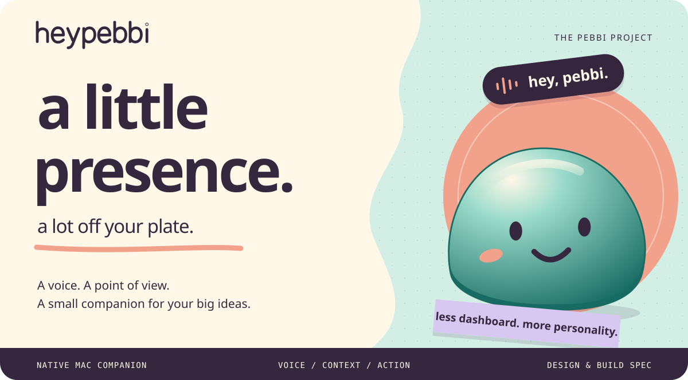
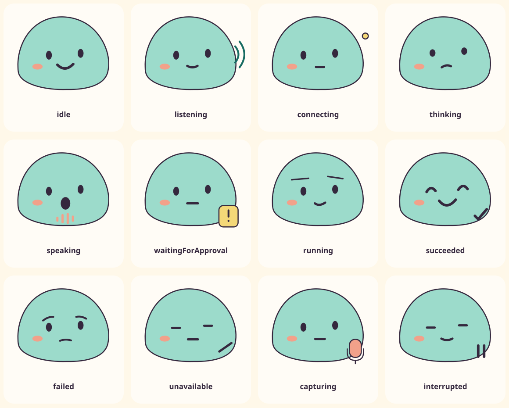

<p align="center">
  
</p>

<p align="center">
  <strong>a softer side of software.</strong><br>
  A voice-first Mac companion with a little character and a lot to help with.
</p>

<p align="center">
  <a href="docs/design/BRAND.md">the world</a> &nbsp; · &nbsp;
  <a href="docs/product/LOCAL-AZURE-ONBOARDING.md">your Azure setup</a> &nbsp; · &nbsp;
  <a href="docs/CONTRACT.md">the blueprint</a> &nbsp; · &nbsp;
  <a href="docs/agents/BUILD-PROMPT.md">future build brief ↗</a>
</p>

<br>

## Your ideas don't arrive in neat little boxes.

They arrive mid-tab, mid-thought, halfway through something else.

**Pebbi is being designed to meet you there.** The vision is a small, expressive Mac companion. The current documented feature is simpler: connect your own Azure resource, choose your deployments, and keep your key in macOS Keychain. The broader ideas below are design studies, not implemented features.

<table>
  <tr>
    <td width="33%" valign="top">
      <h3>01 &nbsp; say it.</h3>
      Natural conversation.<br>
      Dictation where you work.<br>
      Less translating thoughts into clicks.
    </td>
    <td width="33%" valign="top">
      <h3>02 &nbsp; share the view.</h3>
      Screen context, when you choose.<br>
      Guidance that points to the thing.<br>
      A little less “which button?”
    </td>
    <td width="33%" valign="top">
      <h3>03 &nbsp; make room.</h3>
      Persistent Pebbis, files and memory.<br>
      Tasks with visible progress.<br>
      Important actions stay your call.
    </td>
  </tr>
</table>

<br>

## Sea-glass. Clay. A bit of mischief.

Warm paper. Rounded type. Glazed ceramic. A companion with an actual silhouette—not another glowing orb.

Colorful without shouting. Tactile without getting in the way. **Native to the Mac, not a website wearing a window.**

<p align="center">
  
</p>

<p align="center">
  <sub>same little pebble. different things on its mind.</sub><br><br>
  <a href="docs/design/BRAND.md">Brand story</a> &nbsp; / &nbsp;
  <a href="DESIGN.md">Colors &amp; type</a> &nbsp; / &nbsp;
  <a href="docs/design/brand-board.html">Visual studies</a>
</p>

<br>

## Open the sketchbook.

| Follow your curiosity | Find your way |
| :--- | :--- |
| **What is Pebbi?** | [The product](docs/product/PRODUCT.md) · [Every app flow](docs/product/APP-FLOWS.md) |
| **What does it feel like?** | [The screens](docs/design/SCREENS.md) · [Motion](docs/design/MOTION.md) · [Accessibility](docs/design/ACCESSIBILITY.md) |
| **What is the current scope?** | [Local Azure onboarding](docs/product/LOCAL-AZURE-ONBOARDING.md) · [Current contract](docs/CONTRACT.md) |
| **Where does my key go?** | [Keychain, endpoint safety & acceptance](docs/product/LOCAL-AZURE-ONBOARDING.md) · [MIT license](LICENSE) |
| **Where is everything?** | [Complete documentation map](docs/README.md) · [Canonical contract](docs/CONTRACT.md) |

<br>

> [!NOTE]
> **Docs first. Development on hold.** This public, MIT-licensed repository currently contains specifications and original brand references—not a working app. The active design is [local BYOK Azure onboarding](docs/product/LOCAL-AZURE-ONBOARDING.md): your key, endpoint and model choices; no Pebbi backend, Supabase, Render or Vercel. The app/settings stay on your Mac; actual Azure inference is remote and may incur charges in your account.

<details>
<summary><strong>For the builders — the current feature, not the old full app ↗</strong></summary>

### Development is on hold

The owner currently requests documentation and repository changes only. When implementation is explicitly resumed, use [the bounded build prompt](docs/agents/BUILD-PROMPT.md) for BYOK-001 through BYOK-012: first-run configuration, local validation, Keychain save/load, settings/edit/reset and accessibility.

Users choose deployments for reasoning/tasks, realtime conversation, speech-to-text and speech generation. Optional roles can remain disabled. No fixed owner models, shared keys, managed account, hosted backend or subscription service is required. Saving a profile never proves live Azure access.

Claude Code's `/build-pebbi` is retained as a compatibility entry point to **this single feature**. Reading it is not permission to begin implementation.

### Verify the documentation

```sh
python3 scripts/validate_docs.py
npx -y @google/design.md lint DESIGN.md
```

The checker includes retained historical PB/API references; these are document-integrity checks, not current app tests. Earlier hosted-service plans remain clearly labeled history in [the documentation map](docs/README.md).

[AGENTS.md](AGENTS.md) · [AGENT.md](AGENT.md) · [CLAUDE.md](CLAUDE.md) · [Project agents & skills](.claude/README.md)

</details>

<details>
<summary><strong>The fine print — sources, rights &amp; reality</strong></summary>

Original Pebbi software, documentation and brand artwork are offered under the [MIT license](LICENSE), with no trademark-clearance claim. Public product references are mapped in [HeyClicky coverage](docs/reference/HEYCLICKY-COVERAGE.md), with [sources and boundaries](docs/reference/SOURCES.md). No proprietary HeyClicky code or branding is included. Any future MIT-source reuse must retain its notices.

[Third-party notices](THIRD-PARTY-NOTICES.md) · [License](LICENSE). `heypebbi.com` is the selected domain, not a claim of registration or trademark clearance.

</details>

<br>

<p align="center">
  <br>
  <strong>small presence. big possibility.</strong><br>
  <sub>the heypebbi project</sub>
</p>
